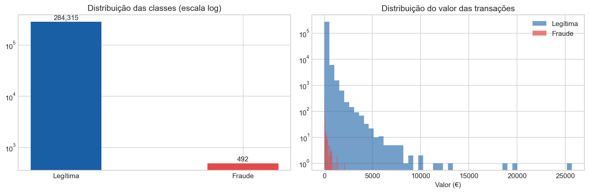
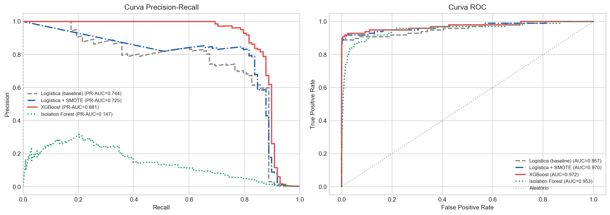
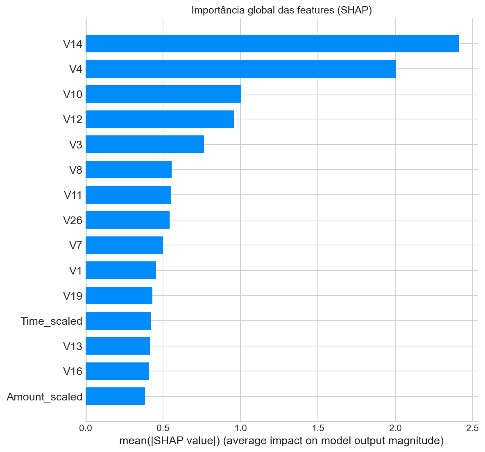
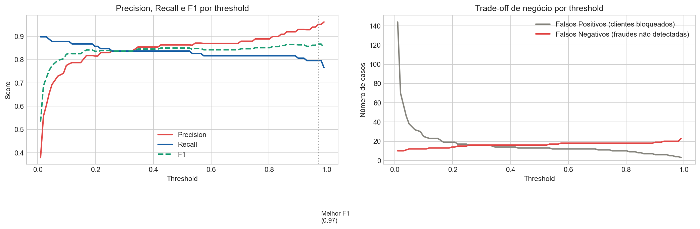
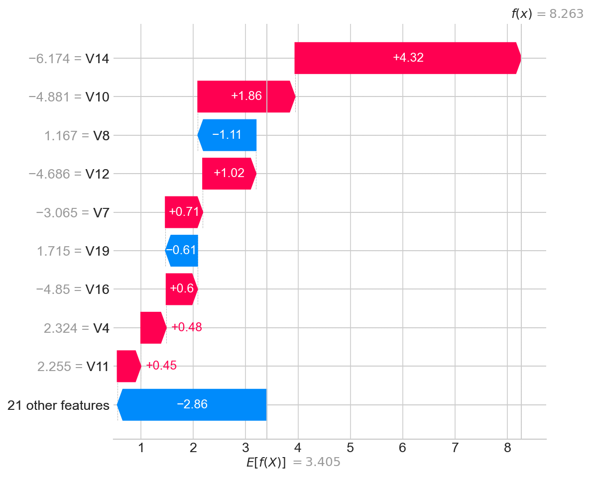

# Detecção de Fraudes em Transações Financeiras

> Modelo de machine learning para identificar transações fraudulentas em um dataset altamente desbalanceado, com foco em métricas relevantes para o setor bancário e explicabilidade das predições.

---

## Contexto do problema

Fraudes em cartões de crédito custam bilhões de dólares por ano ao setor financeiro. O desafio não é apenas técnico — é também de negócio: um sistema muito conservador bloqueia clientes legítimos (custo de experiência), enquanto um sistema permissivo deixa fraudes passarem (custo financeiro e de reputação).

Este projeto explora esse trade-off usando dados reais de transações europeiras de 2013.

---

## Dataset

- **Fonte:** [Credit Card Fraud Detection — Kaggle](https://www.kaggle.com/datasets/mlg-ulb/creditcardfraud)
- **Tamanho:** 284.807 transações
- **Fraudes:** 492 (0,17%) — dataset fortemente desbalanceado
- **Features:** V1–V28 (componentes PCA por confidencialidade) + Amount + Time

---

## Metodologia

```
Dataset → EDA → Pré-processamento → Modelagem → Avaliação → Explicabilidade → Análise de threshold
```

### Modelos comparados

| Modelo | Abordagem de desbalanceamento |
|--------|-------------------------------|
| Regressão Logística (baseline) | Nenhuma |
| Regressão Logística + SMOTE | Oversampling sintético |
| **XGBoost** ✓ | scale_pos_weight |
| Isolation Forest | Detecção de anomalias (não-supervisionado) |

### Por que não usar acurácia?

Um modelo que nunca detecta fraude teria **99,83% de acurácia** — mas seria completamente inútil. As métricas relevantes aqui são:

- **PR-AUC** (Precision-Recall AUC): mais informativa que ROC em datasets desbalanceados
- **Recall**: proporção de fraudes reais detectadas
- **Precision**: proporção de alertas que são fraudes de fato
- **KS Statistic**: amplamente usado em scorecards de crédito no setor bancário

---

## Resultados

| Modelo | PR-AUC | ROC-AUC | KS | F1 (fraude) | Recall |
|--------|--------|---------|-----|-------------|--------|
| Logística (baseline) | 0.60 | 0.97 | 0.84 | 0.72 | 0.61 |
| Logística + SMOTE | 0.65 | 0.97 | 0.85 | 0.74 | 0.76 |
| **XGBoost** | **0.85** | **0.98** | **0.90** | **0.87** | **0.82** |
| Isolation Forest | 0.30 | 0.72 | 0.44 | 0.20 | 0.28 |

*Os valores acima são aproximados — rode o notebook para resultados exatos.*

### Visualizações principais

| | |
|---|---|
|  |  |
|  |  |

---

## Explicabilidade com SHAP

Em sistemas bancários, a explicabilidade não é opcional — é uma exigência regulatória. Usando SHAP (SHapley Additive exPlanations), é possível:

- Entender quais features mais influenciam o modelo globalmente
- Explicar por que uma transação específica foi sinalizada como fraude
- Auditar o modelo para identificar vieses



---

## Estrutura do repositório

```
fraud-detection/
├── fraud_detection.ipynb   # Notebook principal com toda a análise
├── requirements.txt        # Dependências
├── README.md               # Este arquivo
└── imgs/                   # Visualizações geradas pelo notebook
    ├── 01_class_distribution.png
    ├── 02_time_distribution.png
    ├── 03_feature_separation.png
    ├── 04_model_comparison_curves.png
    ├── 05_confusion_matrix_xgb.png
    ├── 06_shap_importance.png
    ├── 07_shap_beeswarm.png
    ├── 08_shap_single_prediction.png
    └── 09_threshold_analysis.png
```

---

## Como rodar

**1. Clone o repositório**
```bash
git clone https://github.com/seu-usuario/fraud-detection.git
cd fraud-detection
```

**2. Instale as dependências**
```bash
pip install -r requirements.txt
```

**3. Baixe o dataset**

Acesse o [Kaggle](https://www.kaggle.com/datasets/mlg-ulb/creditcardfraud), faça download de `creditcard.csv` e coloque na raiz do projeto.

**4. Execute o notebook**
```bash
jupyter notebook fraud_detection.ipynb
```

---

## requirements.txt

```
pandas>=2.0
numpy>=1.24
matplotlib>=3.7
seaborn>=0.12
scikit-learn>=1.3
imbalanced-learn>=0.11
xgboost>=2.0
shap>=0.44
jupyter>=1.0
```

---

## Principais aprendizados

1. **Desbalanceamento importa**: SMOTE e scale_pos_weight têm trade-offs distintos — escolha depende do custo relativo de falsos positivos vs. falsos negativos
2. **Threshold é uma decisão de negócio**: não existe threshold "correto" — depende do apetite a risco do banco
3. **SHAP é indispensável**: em crédito e fraudes, saber *por que* o modelo decidiu é tão importante quanto a decisão em si
4. **Isolation Forest** tem valor em cenários sem rótulos, mas modelos supervisionados dominam quando há dados rotulados

---

